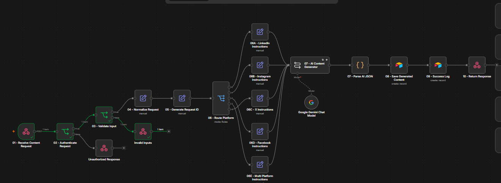
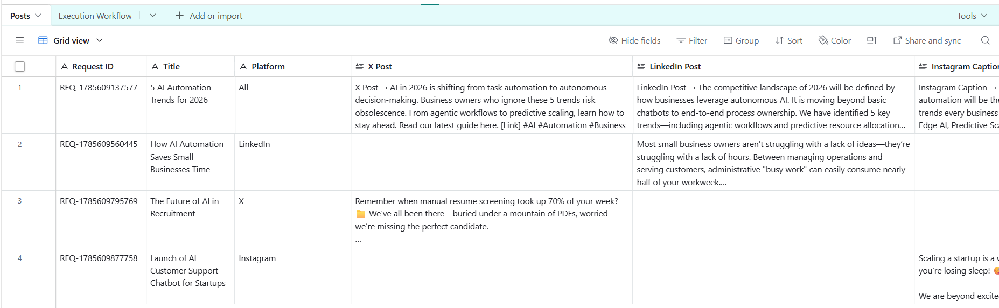
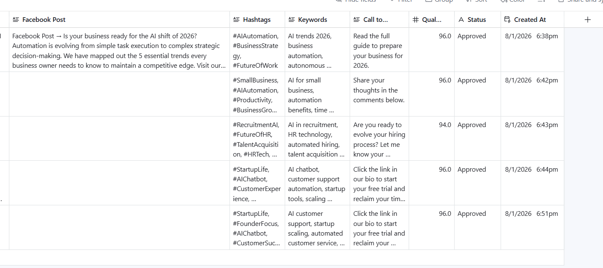
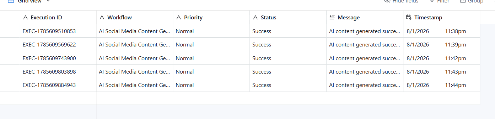
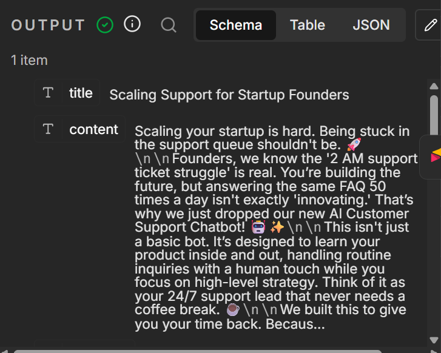
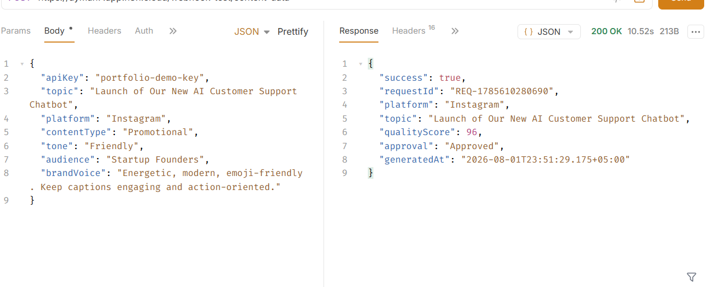

# 🚀 AI Social Media Content Generator

A production-ready AI-powered social media automation workflow built with **n8n**, **Google Gemini**, **Airtable**, and **Webhooks**.

The workflow generates high-quality content tailored for different social media platforms, stores generated posts in Airtable, and logs every workflow execution.

---

## ✨ Features

- API Key Authentication
- Webhook API
- Request Validation
- AI-powered content generation
- Platform-aware content generation
- Brand Voice support
- Multiple Content Types
- Quality Score
- Automatic Approval
- Airtable Integration
- Workflow Logging
- JSON API Response

---

## 🛠 Tech Stack

- n8n
- Google Gemini
- Airtable
- Webhooks
- JavaScript

---

## 📊 Workflow

```text
Webhook
    │
Authenticate Request
    │
Validate Input
    │
Normalize Request
    │
Generate Request ID
    │
Save Content Request
    │
Generate AI Content
    │
Parse AI JSON
    │
Save Generated Content
    │
Update Request Status
    │
Log Success
    │
Respond to Webhook
```

---

## 📥 Sample Request

```json
{
  "apiKey": "portfolio-demo-key",
  "topic": "How AI Automation Saves Small Businesses Time",
  "platform": "LinkedIn",
  "contentType": "Educational",
  "tone": "Professional",
  "audience": "Small Business Owners",
  "brandVoice": "Professional, educational, concise."
}
```

---

## 📤 Sample Response

```json
{
  "success": true,
  "requestId": "REQ-1785609560445",
  "platform": "LinkedIn",
  "qualityScore": 96,
  "approval": "Approved"
}
```

---

## 📂 Airtable Structure

### Content Requests

- Request ID
- Topic
- Platform
- Content Type
- Tone
- Audience
- Brand Voice
- Status
- Created At

### Generated Content

- Request ID
- Title
- Platform
- LinkedIn Post
- X Post
- Instagram Caption
- Facebook Post
- Hashtags
- Keywords
- Call To Action
- Quality Score
- Status
- Generated At

### Workflow Executions

- Execution ID
- Workflow
- Status
- Message
- Timestamp

---

## 📸 Screenshots


### Workflow Overview


### Airtable Records






### AI Response


### Webhook Response



---

## 🎥 Demo

A short 60–90 second demo should show:

1. Send a webhook request.
2. AI generates content.
3. Airtable stores the request and generated content.
4. Workflow execution log updates.
5. API returns a success response.

---

## 📄 License

MIT
